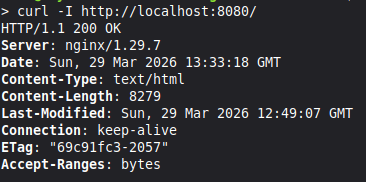
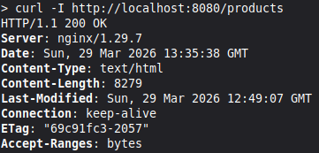
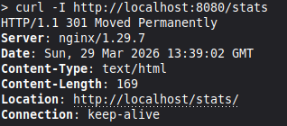
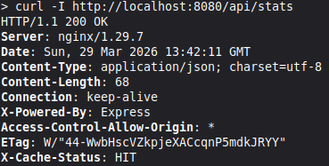
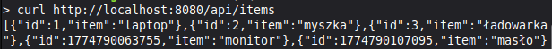
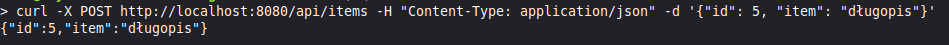

## Rozwiązanie zadania 1

1. Struktura katalogów wraz z zawartością widoczna na GitHub, branch `zadanie1`
2. Pliki `Dockerfile` znajdują się odpowiednio w katalogach `/frontend` oraz `/backend`
3. Pliki konfiguracyjne `nginx` znajdują się w katalogu `/frontend` w plikach `default.conf` oraz `cache.conf`
4. Wykorzystane polecenia (kolejno):

```bash
docker build -t szywat/product-backend:v1 -t szywat/product-backend:latest ./backend

docker build -t szywat/product-frontend:v1 -t szywat/product-frontend:latest ./frontend

docker push szywat/product-backend:v1

docker push szywat/product-backend:latest

docker push szywat/product-frontend:v1

docker push szywat/product-frontend:latest

docker rmi szywat/product-backend:v1 szywat/product-backend:latest

docker rmi szywat/product-frontend:v1 szywat/product-frontend:latest

docker pull szywat/product-backend:latest

docker pull szywat/product-frontend:latest

docker network create product-network

docker run -d --name backend --network product-network szywat/product-backend:latest

docker run -d --name frontend --network product-network -p 8080:80 szywat/product-frontend:latest
```

5. Testy:  
   
   
   
   
   
   
