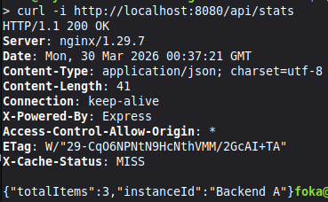
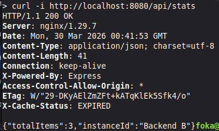

## Rozwiązanie zadania 2

1. Zmodyfikowana konfiguracja `nginx` znajduje się w `/frontend/default.conf`
2. Komendy uruchamiające dwie instancje backendu:

```bash
docker run -d --name api-a \
  --network product-network \
  -e INSTANCE_ID="Backend-A" \
  szywat/product-backend:latest

docker run -d --name api-b \
  --network product-network \
  -e INSTANCE_ID="Backend-B" \
  szywat/product-backend:latest

docker run -d --name frontend-v2 \
  --network product-network \
  -p 8080:80 \
  szywat/product-frontend:v2
```

3. Komendy budowania, tagowania i publikacji obrazu frontendu oraz backendu:

```bash
docker build -t szywat/product-frontend:v2 ./frontend
docker tag szywat/product-frontend:v2 szywat/product-frontend:latest

docker build -t szywat/product-backend:v2 ./backend
docker tag szywat/product-backend:v2 szywat/product-backend:latest

docker push szywat/product-frontend:v2
docker push szywat/product-frontend:latest
docker push szywat/product-backend:v2
docker push szywat/product-backend:latest
```

4. Testy:  
     
   
